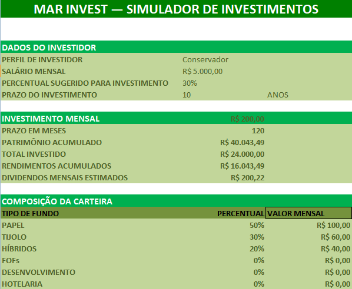

# MAR INVEST — Simulador de Investimentos

O **MAR INVEST** é um simulador de investimentos desenvolvido em Excel com o objetivo de facilitar a visualização de quanto um investidor pode acumular ao longo do tempo a partir de um aporte mensal.

O projeto foi desenvolvido com uma proposta simples, visual e prática, permitindo inserir informações básicas do investidor e acompanhar projeções de patrimônio, rendimentos e dividendos mensais.

A planilha foi desenvolvida em **Excel 2007**, utilizando fórmulas e recursos compatíveis com essa versão.

## Objetivo

O objetivo do MAR INVEST é demonstrar, de forma prática, como diferentes aportes mensais e períodos de investimento podem influenciar a evolução do patrimônio.

O simulador permite visualizar:

- valor disponível para investimento;
- aporte mensal;
- total investido;
- rendimentos acumulados;
- patrimônio acumulado;
- dividendos mensais estimados;
- rendimento sobre o total investido;
- composição da carteira;
- diferentes cenários de investimento.

## Funcionalidades

### Dados do investidor

O simulador permite informar:

- Perfil de investidor;
- Salário mensal;
- Percentual destinado a investimentos;
- Prazo do investimento.

### Investimento mensal

A planilha apresenta o valor disponível para investimento e calcula automaticamente os principais resultados da simulação.

### Projeção do investimento

São apresentados:

- Aporte mensal;
- Total investido;
- Rendimentos acumulados;
- Patrimônio acumulado;
- Dividendos mensais estimados;
- Rendimento sobre o total investido.

### Composição da carteira

A carteira é apresentada de acordo com o perfil selecionado, considerando diferentes tipos de fundos:

- Papel;
- Tijolo;
- Híbridos;
- FOFs;
- Desenvolvimento;
- Hotelaria.

### Cenários de investimento

O simulador apresenta cenários fixos para:

- 1 ano;
- 3 anos;
- 5 anos;
- 7 anos;
- 10 anos.

Cada cenário apresenta o total investido e os dividendos mensais estimados.

## Perfis de investidor

O projeto utiliza três perfis ilustrativos:

- **Conservador**
- **Moderado**
- **Agressivo**

A composição da carteira varia de acordo com cada perfil.

> **Observação:** a classificação dos perfis e suas respectivas composições são meramente ilustrativas. O nível de risco de um investimento depende de fatores como composição da carteira, política de investimentos, gestão e condições de mercado.

## Premissa de rendimento

A simulação utiliza uma taxa de rendimento mensal de:

**0,80% a.m.**

Essa taxa é utilizada como premissa para os cálculos apresentados no simulador.

## Tecnologias utilizadas

- Microsoft Excel 2007
- Fórmulas financeiras do Excel
- Formatação e organização de dados em planilha

## Estrutura do projeto

O projeto é composto por duas áreas principais:

### MAR INVEST
Página principal do simulador, contendo os dados do investidor, investimento mensal, composição da carteira, projeção do investimento e cenários.

### BASE DO SIMULADOR
Base utilizada para apoiar os perfis de investidor e a composição das carteiras.

## Exemplo de simulação

Considerando um aporte mensal de **R$ 200,00** durante **10 anos**, com rendimento mensal de **0,80%**, a simulação apresenta:

- **Total investido:** R$ 24.000,00
- **Rendimentos acumulados:** R$ 16.043,49
- **Patrimônio acumulado:** R$ 40.043,49
- **Dividendos mensais estimados:** R$ 200,22
- **Rendimento sobre o total investido:** 66,85%

## Objetivo do projeto

O MAR INVEST foi desenvolvido como projeto de aplicação prática de conhecimentos em Excel, Claude, Inteligência Artificial, organização de dados, fórmulas financeiras, simulação e apresentação visual de informações.

---

**MAR INVEST — Simulador de Investimentos**
